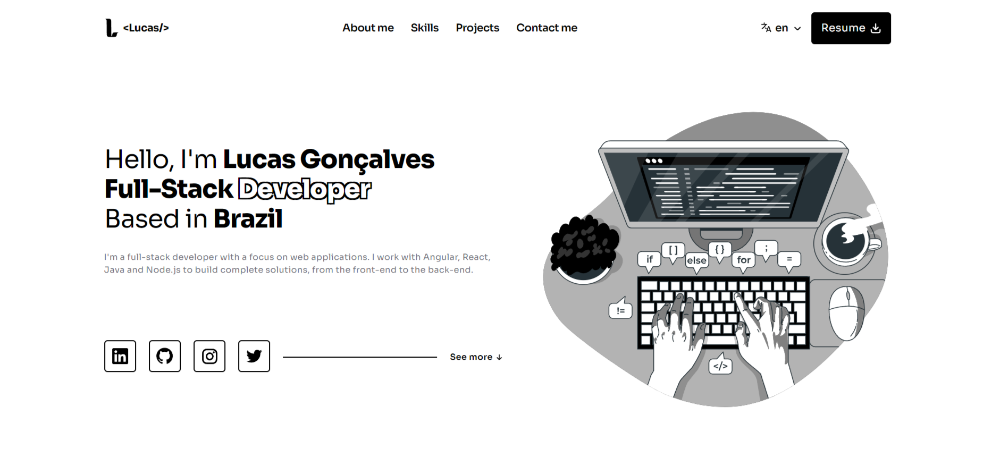

[Leia em Português](README.pt-BR.md)

# My personal portfolio

This is my personal portfolio, where I showcase my projects and the technologies I use, and share some insights into who I am as a developer. My goal was to create a clean, responsive design that reflects my visual identity.

Preview:  

### ✨ Tech

  

### 💡 Features

- Home page
- List of skills with dynamic and responsive icons
- About me section
- List of projects with description and link to demo and repository
- Contact form with validation through a simple API developed by me
- Responsiveness
- Localization for PT/EN

Developed by [Lucas Gonçalves](https://github.com/lucca16bit) | UI/UX Design by [Figma Community](https://www.figma.com/community/file/1318529372146880502/illustration-based-portfolio-website-template)
