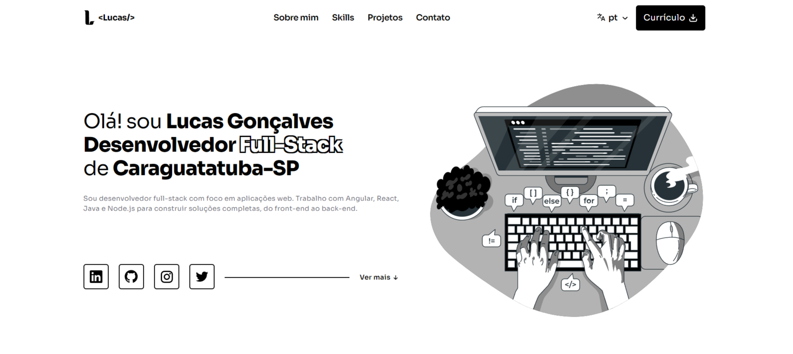

[Read in English](README.md)

# Meu portifólio pessoal

Este é o meu portfólio pessoal, um espaço onde apresento meus projetos, tecnologias que utilizo e um pouco sobre quem eu sou como dev. A ideia foi criar uma experiência limpa, responsiva e com minha identidade visual.

Preview:  

### ✨ Tecnologias utilizadas

  

### 💡 Funcionalidades

- Página inicial
- Lista de habilidades com ícones dinâmicos e responsivo
- Sessão sobre mim
- Lista de projetos com descrição e link para demo e repositório
- Formulário de contato com validação através de uma API simples desenvolvida por mim
- Responsividade
- Localização para PT/EN

Desenvolvido por [Lucas Gonçalves](https://github.com/lucca16bit) | UI/UX Design por [Figma Community](https://www.figma.com/community/file/1318529372146880502/illustration-based-portfolio-website-template)
